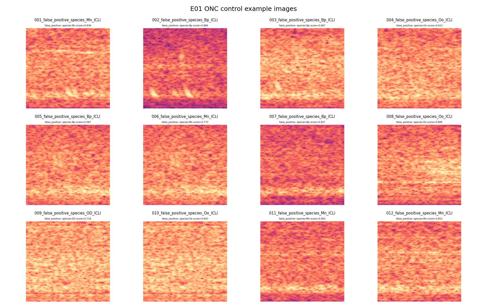
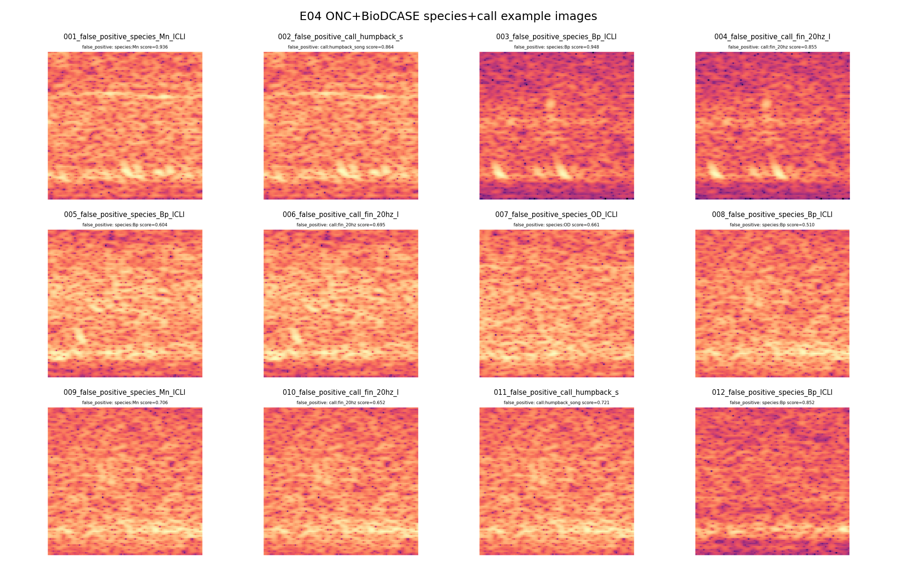
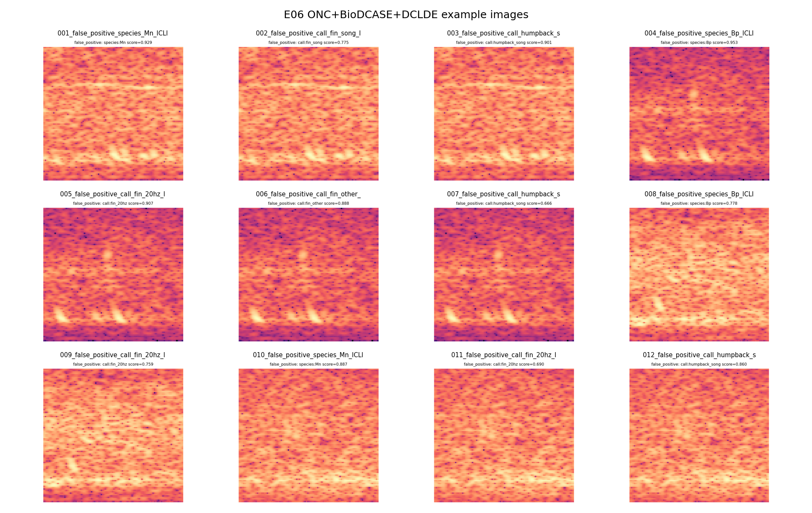

# Weekend Multi-Species Dataset Analysis

## Short Diagnosis

The external datasets are not failing because they lack signal. They are failing because the model is learning source-specific decision boundaries that do not transfer cleanly back to ONC deployment audio. BioDCASE and DCLDE add real whale examples, but they also shift the model toward higher primary-species scores on ONC background. That shows up as much higher background false positives and weaker ONC Oo/Mn precision.

The simpler species-only control remains the best deployable baseline. Adding call-type labels and external sources expands the label space before the source/domain problem is under control. The next modeling step should probably simplify back to species-only and then reintroduce call type after source-aware calibration or embeddings are working.

## ONC-Gated Metrics

| run | ONC macro F1 | ONC micro F1 | ONC background FP | Bm F1 | Bp F1 | Mn F1 | Oo F1 |
| --- | --- | --- | --- | --- | --- | --- | --- |
| E01 ONC control | 0.6372 | 0.6207 | 0.4138 | 0.8889 | 0.5957 | 0.5455 | 0.5185 |
| E04 ONC+BioDCASE species+call | 0.6549 | 0.6289 | 0.6897 | 0.9333 | 0.6316 | 0.5283 | 0.5263 |
| E06 ONC+BioDCASE+DCLDE | 0.5944 | 0.5660 | 0.7241 | 0.9286 | 0.5909 | 0.4898 | 0.3684 |

## What Looks Wrong

- E06 added DCLDE killer-whale positives and hard negatives, but ONC Oo precision dropped instead of improving. That means the DCLDE examples are not teaching the model an ONC-compatible killer-whale boundary.
- The biggest deployment problem is background calibration. The combined runs push many ONC background windows over at least one species threshold.
- Mn and Oo are the fragile labels. Their recall can look acceptable, but precision collapses because the model starts assigning these labels to ONC background or other-species rows.
- Call labels probably made the initial external-data problem harder: the model had to learn species, call taxonomy, and source shift at the same time.

## Dataset/Training Hypotheses

- Source mismatch: BioDCASE and DCLDE have different hydrophones, annotation styles, event durations, frequency ranges, and background scenes than the ONC held-out target.
- Background definition mismatch: DCLDE hard negatives are selected confounders, while ONC background includes local noise and ambiguous low-frequency events. A negative from one source is not automatically a good negative for another.
- Label granularity mismatch: ONC OD was demoted correctly, but DCLDE adds explicit Oo. That helps ontology, yet it changes the class boundary unless ONC-like Oo/background examples anchor it.
- Threshold transfer: thresholds optimized on the mixed validation set do not necessarily produce good ONC deployment thresholds.
- Pos-weight and source imbalance likely encourage sensitivity over specificity, which worsens background false positives.

## Figures

- 
- 
- 
- 
- 
- 
- 

## Recommended Next Experiments

1. Run a species-only ladder before call-type training: ONC control, ONC+BioDCASE species-only, ONC+DCLDE species-only, then ONC+BioDCASE+DCLDE species-only.
2. Evaluate with ONC-only thresholds, not only mixed validation thresholds. Treat ONC deployment as the primary calibration target.
3. Try source-balanced batches or source-aware loss weighting so external data cannot dominate gradients or calibration.
4. Add explicit ONC-like hard negatives for Oo/Mn/background before scaling DCLDE.
5. Start an embedding branch: extract Perch/other foundation embeddings for ONC/BioDCASE/DCLDE caps, train linear/MLP probes, and compare source-separable clusters. If embeddings separate source more strongly than label, that confirms domain shift and suggests adaptation/calibration work before more ResNet training.

## Manifest Composition

### E01 ONC control

- Rows: `582`
- Source counts: `{"ONC": 582}`
- Primary species counts: `{"<background>": 200, "species:Bm": 100, "species:Bp": 101, "species:Mn": 100, "species:Oo": 82}`
- Top call counts: `{"<no-call-label>": 582}`

### E04 ONC+BioDCASE species+call

- Rows: `1032`
- Source counts: `{"BioDCASE": 450, "ONC": 582}`
- Primary species counts: `{"<background>": 300, "species:Bm": 300, "species:Bp": 251, "species:Mn": 100, "species:Oo": 82}`
- Top call counts: `{"<no-call-label>": 522, "call:blue_A": 50, "call:blue_B": 50, "call:blue_D": 50, "call:blue_Z": 50, "call:fin_20hz": 143, "call:fin_20hz_plus": 50, "call:fin_downsweep": 50, "call:fin_other": 5, "call:humpback_song": 59}`

### E06 ONC+BioDCASE+DCLDE

- Rows: `1424`
- Source counts: `{"BioDCASE": 450, "DCLDE": 392, "ONC": 582}`
- Primary species counts: `{"<background>": 498, "species:Bm": 300, "species:Bp": 251, "species:Mn": 100, "species:Oo": 276}`
- Top call counts: `{"<no-call-label>": 720, "call:blue_A": 50, "call:blue_B": 50, "call:blue_D": 50, "call:blue_Z": 50, "call:fin_20hz": 143, "call:fin_20hz_plus": 50, "call:fin_downsweep": 50, "call:humpback_song": 59, "call:orca_call": 194}`

