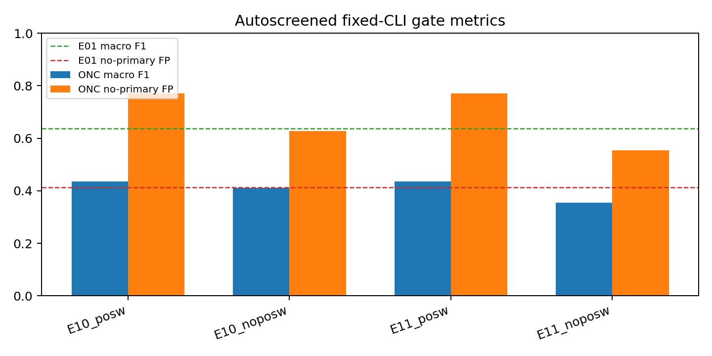
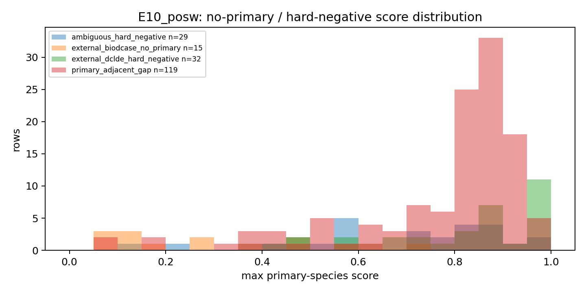
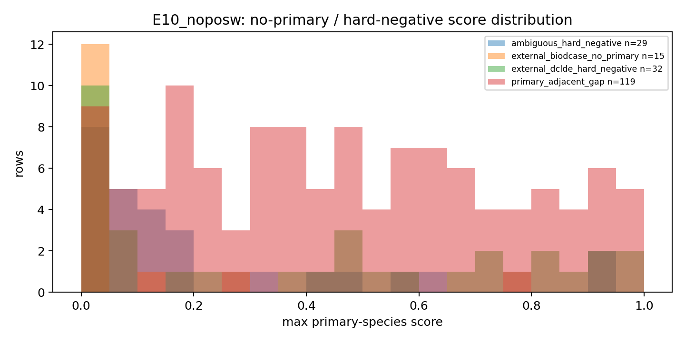
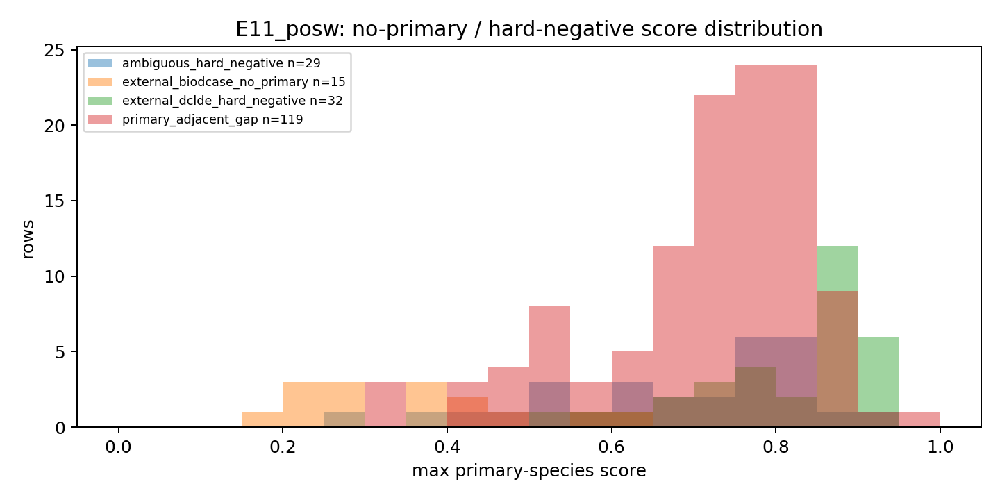
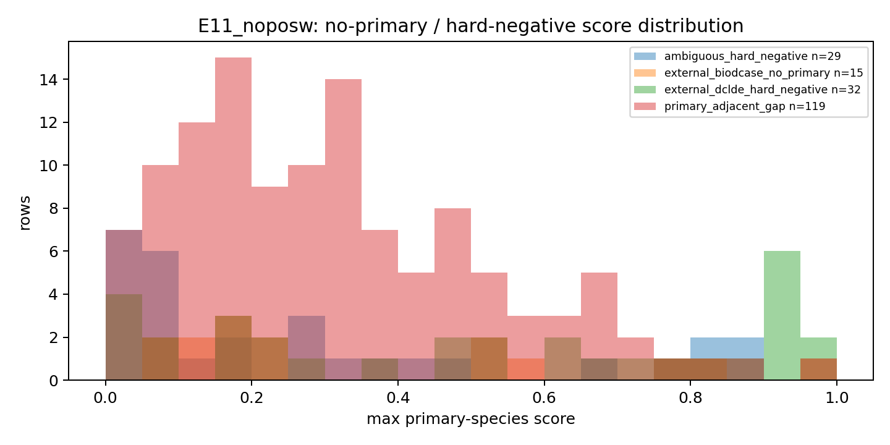
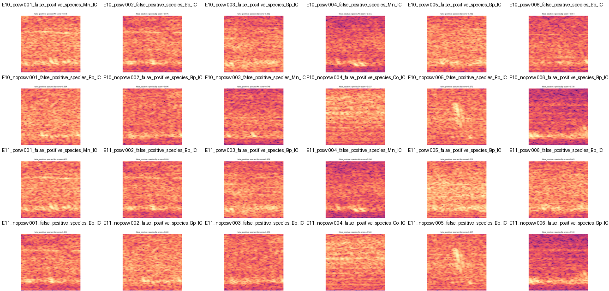

# Fixed-CLI Autoscreened Species Results - 2026-05-06

All four fixed-CLI jobs completed all 20 epochs and produced prediction artifacts. They do not pass the deployability gate: ONC macro F1 is well below the E01 control, and hard-negative/no-primary false-positive rates remain above the E01 no-primary reference. These FP rates are not clean reviewed-background FP because the current no-primary bucket is auto-screened/hard-negative rather than human-confirmed reviewed background.

## Gate Summary

| Run | Job | ONC Macro F1 | ONC Micro F1 | ONC No-Primary FP | Gate |
|---|---:|---:|---:|---:|---|
| E10_posw | 13399266 | 0.4357 | 0.3667 | 0.7703 (114/148) | FAIL |
| E10_noposw | 13399267 | 0.4109 | 0.3609 | 0.6284 (93/148) | FAIL |
| E11_posw | 13399268 | 0.4356 | 0.3771 | 0.7703 (114/148) | FAIL |
| E11_noposw | 13399269 | 0.3549 | 0.3557 | 0.5541 (82/148) | FAIL |

References: E01 ONC macro F1 0.6372, E01 no-primary/background FP 0.4138, previous E09 species-only macro 0.6386 with no-primary FP 0.8276.

Best ONC macro in this batch: E10_posw at 0.4357. Best no-primary FP in this batch: E11_noposw at 0.5541. Neither is deployable relative to E01.

## Per-Label ONC Metrics

| Run | Label | F1 | Precision | Recall | TP | FP | FN |
|---|---|---:|---:|---:|---:|---:|---:|
| E10_posw | species:Bm | 0.8837 | 0.8261 | 0.9500 | 19 | 4 | 1 |
| E10_posw | species:Bp | 0.3404 | 0.2182 | 0.7742 | 24 | 86 | 7 |
| E10_posw | species:Mn | 0.2963 | 0.1761 | 0.9333 | 28 | 131 | 2 |
| E10_posw | species:Oo | 0.2222 | 0.1667 | 0.3333 | 4 | 20 | 8 |
| E10_noposw | species:Bm | 0.8636 | 0.7917 | 0.9500 | 19 | 5 | 1 |
| E10_noposw | species:Bp | 0.2857 | 0.3200 | 0.2581 | 8 | 17 | 23 |
| E10_noposw | species:Mn | 0.2718 | 0.1918 | 0.4667 | 14 | 59 | 16 |
| E10_noposw | species:Oo | 0.2222 | 0.1373 | 0.5833 | 7 | 44 | 5 |
| E11_posw | species:Bm | 0.8108 | 0.8824 | 0.7500 | 15 | 2 | 5 |
| E11_posw | species:Bp | 0.3462 | 0.2466 | 0.5806 | 18 | 55 | 13 |
| E11_posw | species:Mn | 0.3354 | 0.2061 | 0.9000 | 27 | 104 | 3 |
| E11_posw | species:Oo | 0.2500 | 0.1667 | 0.5000 | 6 | 30 | 6 |
| E11_noposw | species:Bm | 0.8182 | 0.7500 | 0.9000 | 18 | 6 | 2 |
| E11_noposw | species:Bp | 0.2041 | 0.2778 | 0.1613 | 5 | 13 | 26 |
| E11_noposw | species:Mn | 0.3022 | 0.1927 | 0.7000 | 21 | 88 | 9 |
| E11_noposw | species:Oo | 0.0952 | 0.1111 | 0.0833 | 1 | 8 | 11 |

## Hard-Negative / No-Primary Buckets

| Run | Bucket | Rows | Any-Primary FP | Mean Max Score | P90 Max Score |
|---|---|---:|---:|---:|---:|
| E10_posw | ambiguous_hard_negative | 29 | 0.5172 (15/29) | 0.6715 | 0.8945 |
| E10_posw | external_biodcase_no_primary | 15 | 0.0000 (0/15) | 0.3152 | 0.6227 |
| E10_posw | external_dclde_hard_negative | 32 | 0.7188 (23/32) | 0.8289 | 0.9914 |
| E10_posw | primary_adjacent_gap | 119 | 0.8319 (99/119) | 0.7744 | 0.9274 |
| E10_noposw | ambiguous_hard_negative | 29 | 0.5517 (16/29) | 0.2379 | 0.6530 |
| E10_noposw | external_biodcase_no_primary | 15 | 0.2000 (3/15) | 0.0853 | 0.2081 |
| E10_noposw | external_dclde_hard_negative | 32 | 0.6562 (21/32) | 0.3974 | 0.9082 |
| E10_noposw | primary_adjacent_gap | 119 | 0.6471 (77/119) | 0.4639 | 0.8886 |
| E11_posw | ambiguous_hard_negative | 29 | 0.6552 (19/29) | 0.6784 | 0.8210 |
| E11_posw | external_biodcase_no_primary | 15 | 0.0000 (0/15) | 0.3504 | 0.5356 |
| E11_posw | external_dclde_hard_negative | 32 | 0.9062 (29/32) | 0.8124 | 0.9218 |
| E11_posw | primary_adjacent_gap | 119 | 0.7983 (95/119) | 0.7165 | 0.8406 |
| E11_noposw | ambiguous_hard_negative | 29 | 0.3448 (10/29) | 0.2906 | 0.8182 |
| E11_noposw | external_biodcase_no_primary | 15 | 0.3333 (5/15) | 0.3726 | 0.8009 |
| E11_noposw | external_dclde_hard_negative | 32 | 0.5938 (19/32) | 0.5134 | 0.9324 |
| E11_noposw | primary_adjacent_gap | 119 | 0.6050 (72/119) | 0.3147 | 0.6315 |

## Score Histograms

## Representative False Positives

## Recommendation

Stop this ResNet branch for now. The auto-screened hard negatives improved over the worst external-data no-primary FP case in some no-pos-weight runs, but the ONC primary macro dropped too far and primary-adjacent gaps still trigger many Bp/Mn/Oo predictions. The next bounded change should be dataset-side: build a larger and cleaner ONC negative set with stronger exclusion around uncertain whale-like intervals, stratify primary-adjacent gaps by score/visual audit, and consider training a two-stage system where a primary-call detector/gate suppresses species heads on no-primary intervals. If we continue modeling in parallel, an embedding/foundation probe is better justified than more ResNet sweeps on this manifest.
